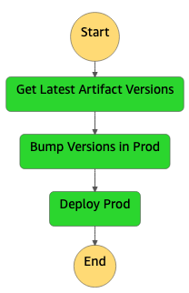
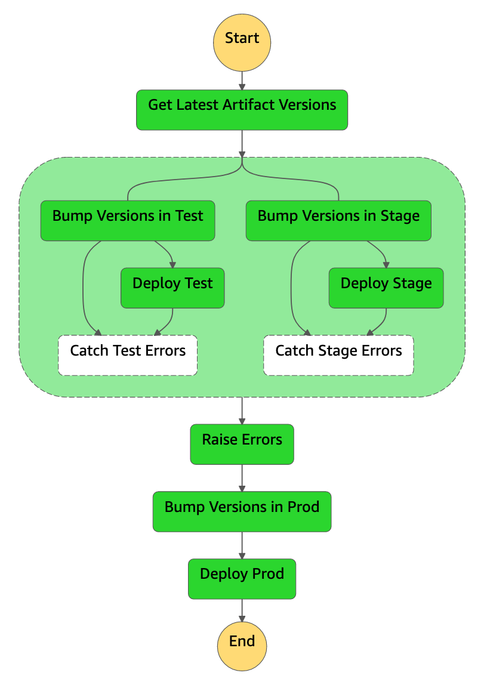
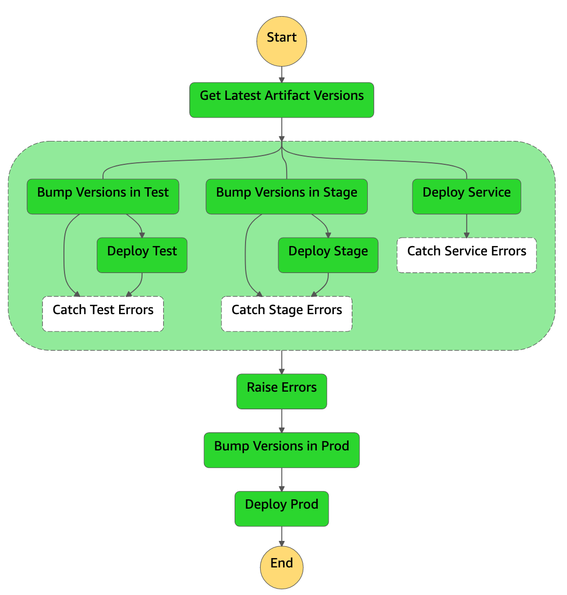
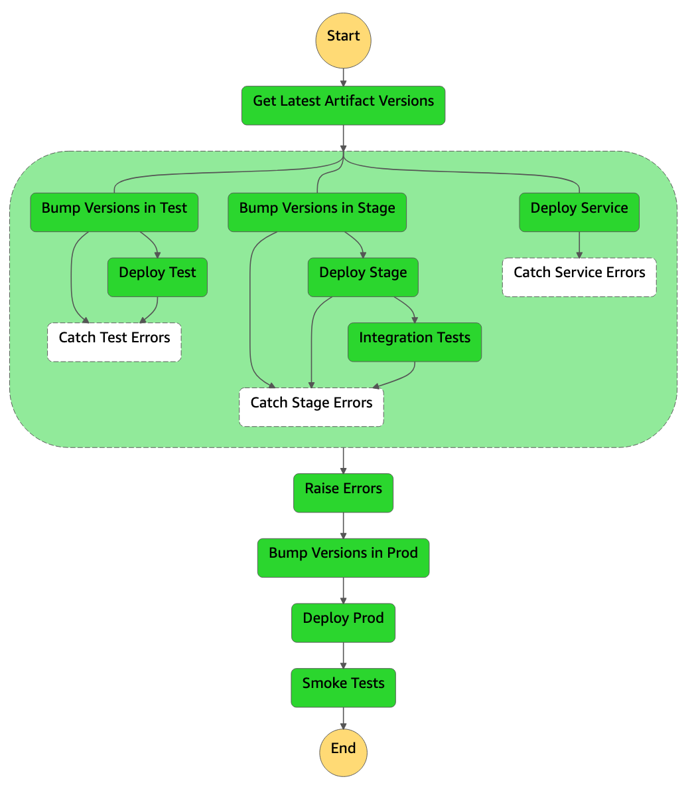

# terraform-aws-sfn-deployment-pipeline
This Terraform module creates a Continuous Deployment (CD) pipeline using AWS Step Functions.

The pipeline deploys to the `test`, `stage` and `service` accounts in parallel, and deploys to `prod` only if all previous states have passed. The module allows you to create pipelines consisting of different combinations of accounts, with the only requirement being that at least one account is being deployed to. See examples below.

The module additionally allows you to add an arbitrary number of _post-deployment_ states to the pipeline -- that is, states that will be run after a successful deployment to `service`, `test`, `stage` or `prod`. These states will spin up a container with a user-defined image, shell command and S3 content. Examples of such states are:
- An `Integration Tests` state after a successful deployment to stage.
- A `Smoke Tests` state after a successful deployment to prod.
- ...

## Requirements
- At least one AWS account.
- A remote backend for Terraform (i.e., encrypted S3 bucket for storing state, DynamoDB table for limiting concurrent edits to state file) in all AWS accounts that the pipeline is configured to deploy to. _(A CloudFormation template is supplied in [cloudformation/](cloudformation/) if you haven't already configured a remote backend)._

## Testing
The Terraform files are separated into different files to make it easy to test the generation of the JSON state machine definition without actually provisioning any AWS resources.

Multiple test cases spanning simple and complex deployment pipelines are set up in [test/](test/).

GitHub Actions is set up to run all the tests on every push to the repository. The tests are run in parallel across different Terraform versions.

## Pipeline Examples
Single Account | Test, Stage & Prod Accounts | All Accounts | All Accounts w/Post-Deployment States
:-------------------------:|:-------------------------:|:------------------------:|:-------------------------:
  |     |    | 
